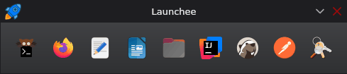

    

  
  
  
   
  
  

## 💻 Launchee

**Launchee** is a clean, minimalist dock for launching your essential shortcuts.

#### Launch anything with a command

Tell Launchee what to run, and it opens instantly.
Point it at a binary, script, or alias, and you’re done.

#### Open the web right where you need it

Start your default browser with a specific URL in one click.
Jump straight into dashboards, docs, or any site without typing.

#### Simple YAML configuration

A clean YAML file powers everything.
Add a name, a path to icon, and a command (or URL) and it's live.
Easy to version, easy to share.

## 💖 Support

Hey there! If you enjoy my work and would like to support me, consider buying me a coffee! :slightly_smiling_face: Your
contributions help me keep creating, and I truly appreciate every bit of support you offer.

  

Also, please consider giving this project a ⭐ on GitHub. This kind of support helps promote the project and lets others
know that it's worth checking out.

Thank you for being amazing!

## ©️ License

© 2025-2025 JDHeim.com

This project is licensed under the Apache License, Version 2.0. See the [LICENSE](LICENSE) file for full license terms.
